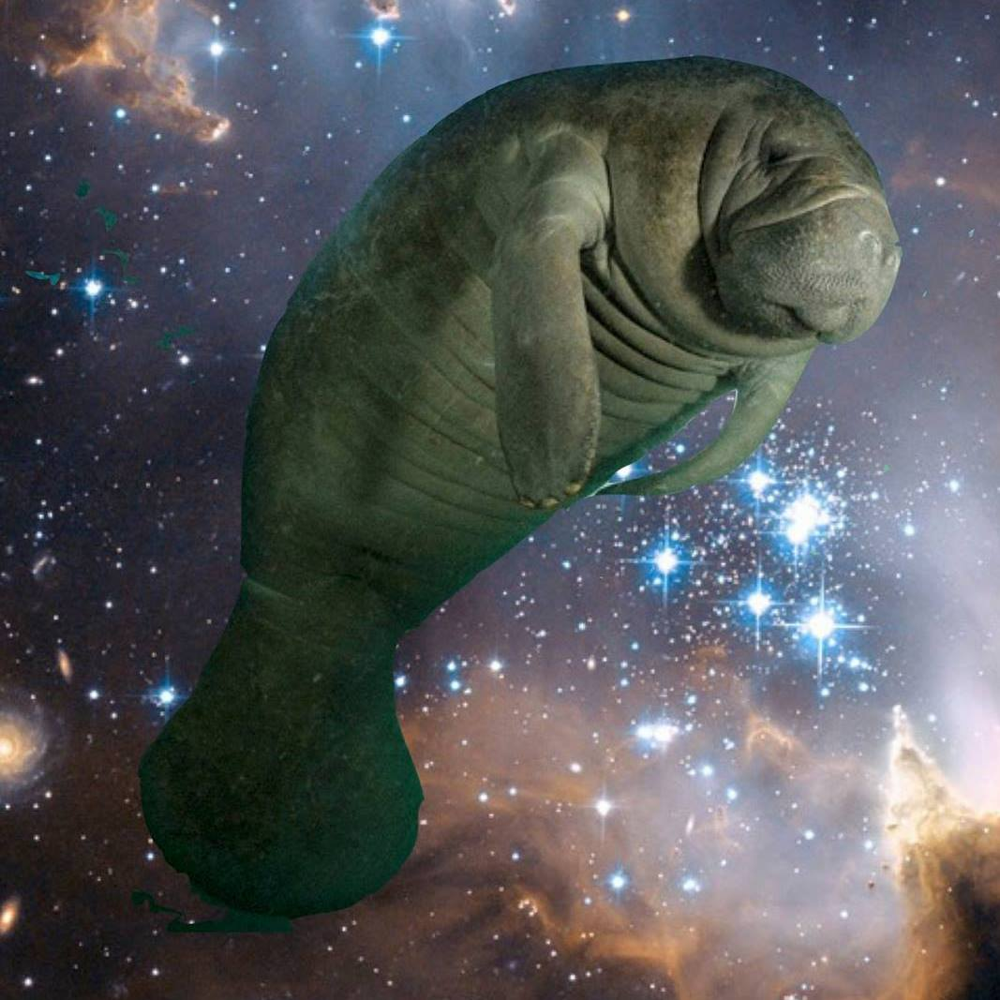
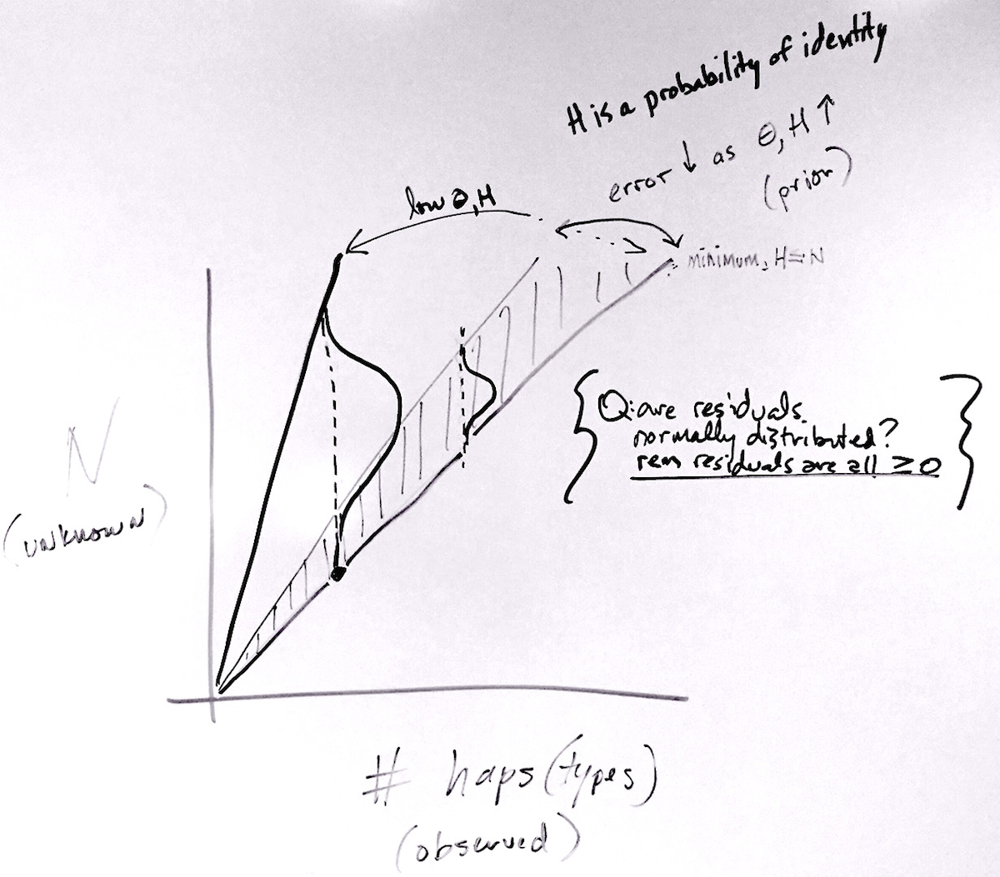
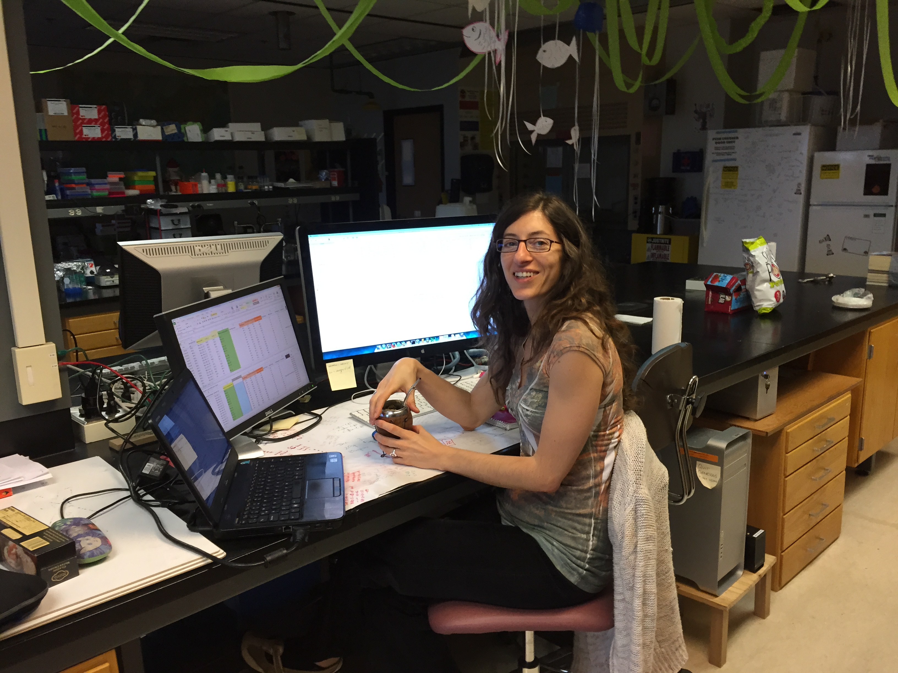

# coin flip

## Barcoding

<style type="text/css">
img {     
  max-height: 500px;     
  max-width: 964px; 
}
</style>
 
<div class="centered">

</div>


When we use a standardized genetic marker to identify species from environmental samples, it is called "genetic barcoding"

- mitochondrial COI and metazoans
- 16S ribosomal and microbes
- FORF and bivalves

## Typically...

Individual tissue/sample harvested, preserved, DNA isolated, PCR, sequencing, match via BLAST or similar algorithm. Requires a database of 'knowns' already, study only as good as prior knowledge can make it!

<style type="text/css">
img {     
  max-height: 400px;     
  max-width: 964px; 
}
</style>
 
<div class="centered">

</div>

## Problems?

> - Imagine a microbe (bacterium). They are probably all the same size, more or less...? 

> - They may (individual) have varying copy number of the 16S gene (see picante.R), and substitutions in the primer site affect PCR efficiency...! 

> - But we use such data routinely (e.g. QIIME) to represent the relative abundance of microbial taxa!

<style type="text/css">
img {     
  max-height: 400px;     
  max-width: 964px; 
}
</style>
 
<div class="centered">

</div>


# Now - think of small metazoans, eukaryotes...

## 

<style type="text/css">
img {     
  max-height: 200px;     
  max-width: 964px; 
}
</style>
<div class="centered">


</div>


## Potentially massive error. Almost useless other than presence/absence?

> - variable volume of individual (2 equal abundant species, one 2x the volume...)
> - variable PCR efficiency (can cause orders of magnitude error)
> - we are left with qPCR approaches to identify 'presence'...
> - or mixed environmental samples where abundance is unreliable!

## Quantitative Barcoding (QuBar)

Goal: environmental sample of organisms (pile of amphipods from an estuary; jar of cladocerans from Carolina Bay; gut contents of a fish), use standard barcode marker, identify what species are present...

...and their relative abundance, with *some* reliability **without using frequency of amplicon sequences**

<style type="text/css">
img {     
  max-height: 300px;     
  max-width: 964px; 
}
</style>
<div class="centered">

</div>

## Why?

Our ability to explore and interpret biodiversity - in space and time - is limited by throughput. Methods that have transformed microbial ecology are valuable for systems with eukaryotes but not yet as directly applied. 

> - community assembly and coexistence

> - compositional change : environmental tracking

> - cryptic diversity (within species) as well as cryptic diversity (hard to observe)

## What information?

- may be able to gauge/estimate total # indivs (volume, count) as **upper limit**
- within *closely* related taxa, PCR efficiency and/or volume may not vary as much (so frequency not always useless)
- **summary statistics from the sequence data?!**

## Summary statistics

Collect related DNA sequence data, align them to each other, that is a lot of information

Ways to summarize:

> - how many unique haplotypes? haplotype diversity?
> - how many variable/segregating sites in the alignment? (S)
> - average pairwise differences ($\pi$)
> - S, $\pi$ are estimators of the almighty <div class="red2">  $\theta$ </div> the 'population mutation rate'

## Example from *Notochthamalus* {.smaller}

```{r NotoPrior, echo=FALSE,warning=FALSE,results='hide',message=FALSE,fig.show='asis'}
# rough estimates from Zakas Q is 10, hapdiv is 0.7
# grabbing a file from Geneious....
library(PopGenome)
file<-readData("FastaSeqs") # actual sample size here is 20. That is the number I'd like to come out...AND, TO AN EXTENT, IT IS AT LEAST IN THE INTERVALS FOR BOTH...
#actual<-20
file@n.sites
basic<-diversity.stats(file)
Hapdiv<-basic@hap.diversity.within #haplotype diversity

Nsite<-basic@n.biallelic.sites #number of seg sites taht are biallelic, for now assume ISM
more<-basic@n.polyallelic.sites
varsite<-Nsite+more

filehaps <- F_ST.stats(file,mode="haplotype",only.haplotype.counts=TRUE)
haplotypecounts <- filehaps@region.stats@haplotype.counts
# this is helpful https://github.com/cran/PopGenome/blob/master/vignettes/Integration_of_new_Methods.Rnw 

########

#install.packages("entropart")
library(entropart)
#need frequencies of haplotypes reported from PopGenome so you can use entropart to get 2D
hapfreq<-unlist(haplotypecounts)
actual<-sum(hapfreq)
hapfreq<-hapfreq/actual
numhaps<-length(hapfreq)

Simp<-expq(Simpson(Ps=hapfreq),q=2)
Gini<-1-(1/Simp)

# Watterson estimator of theta
harm=0
for (n in 1:(actual-1)){
  harm=harm+1/n
}

QW <- varsite/harm
#plot(PSKv[varsite,])
```

Evaluating a sample of sequences from the barnacle *Notochthamalus scabrosus*, where `r actual` individuals were haphazardly sampled from the data of Laughlin et al. [-@Laugh12], we see that these data would traditionally report haplotype diversity *H* of `r Hapdiv`, from `r numhaps` observed haplotypes (most dominant haplotype at frequency `r max(hapfreq)`), and in this instance the Gini-Simpson index is equal to `r Gini`. Now we have another statistic that can be calculated from previous data on the population, that focuses on the number of dominant haplotypes. Here, the inverse Simpson index $^2D$ is `r Simp`, the effective number of haplotypes in the system. The number of segregating sites is `r varsite`.

# n.b. all numbers on previous slide automatically generated. change data set, numbers will automatically respond. thanks R!

## n.b. number 2

The data on previous slide are from a small sample, an environmental sample of *N. scabrosus*. In order to apply this method, we are using *previous information* about *N. scabrosus* (or whatever population/species) to reverse-engineer coalescent maths.

For example, I know from much work on this barnacle that $\theta$ is about 10. I also have prior information with which to estimate *H*.


## Population mutation rate and DIVERSITY

> - $\pi$ and other measures based on (polymorphic) site ***frequency*** spectrum change little as sample size increases >10, and frequency is the problem we are trying to get around

> - the number of segregating sites, however, is **sample-size dependent** and ***not frequency dependent*** (it is just a number)


## Probability: k, n, given $\theta$

```{r 3dchunk,echo=FALSE}
maxindivs=50
library(plot3D)
#Q = 10 # this is PRIOR information
#maxn = min(5*Q,maxindivs) #above 70 this behaves funny???? OR IT MAY BE SOME MULTIPLE OF Q*maxn that is problem?
maxn = 50
obsvdk = 8
#maxk = 2*obsvdk #must be greater than obsvdk

inputPanel(
  selectInput("Q", label = "theta:",
              choices = c(1, 2, 3.5, 5, 10), selected = 2),
  
  sliderInput("Nsite", label = "segregating sites:",
              min = 1, max = 20, value = 4, step = 1)
  
  
)


renderPlot({
  
  
obsvdk = input$Nsite 

maxk = 2*obsvdk #must be greater than obsvdk


a <- c(1:maxn)
b <- c(1:maxk)
PSKv <- numeric(maxn*maxk)
PSKv <- matrix(PSKv,ncol=maxn)
colnames(PSKv)<-a
rownames(PSKv)<-b
Qt<-input$Q

for (n in 2:maxn) {

  for (k in 0:maxk) {

    PSK=0
    for (i in 2:n) {
      Qt<-as.numeric(input$Q)
      PSK<-PSK + ((-1)^i)*(choose((n-1),(i-1)))*((i-1)/(Qt+i-1))*(Qt/(Qt+i-1))^k
      
    }

    PSKv[k,n]<-PSKv[k,n]+PSK
#    obsvd<-PSKv[varsite,] #this is what ultimately is the distribution sliced for the observed number of seg sites

  }
  
}
  par(pin=c(6,5.5))
  hist3D(x=seq(0,1,length.out=nrow(PSKv)),y=seq(0,1,length.out=ncol(PSKv)),PSKv,col=NULL,border="black",theta=40,phi=30,xlab="k",ylab="n",zlab="P{S=k}",alpha=0.35,main=paste((expression(theta))," = ",Qt))


})
```

#

<div class="centered">


</div>


## Hap Diversity

Two ways to evaluate this, both *may* have information in them. 

A population can be described with 'haplotype diversity'

$$ H = \frac{N}{N-1}(1-\sum\limits_{i=1}x_{i}^2) $$

<div class="red2">
but note some frequency information in there...
</div>


(however at a *minimum*, number of haplotypes is minimum number of individuals)

## How to handle haplotype diversity?

Have been experimenting with a gamma distribution but feels very *ad hoc*, e.g. what are parameters for gamma?

```{r, echo=FALSE}
#numhaps=5 this should pass from previous chunk

inputPanel(
  selectInput("numhaps", label = "numhaps/shape param:",
              choices = c(2, 4, 8, 16, 32), selected = 8),
  
  sliderInput("hapdiv", label = "hap diversity/scale param:",
              min = 0, max = 1, value = 0.8, step = 0.05)
)


renderPlot({
  
number<-as.numeric(input$numhaps)  
diversity<-as.numeric(input$hapdiv)
x=1
cdf=0
indprob=0
array<-NULL
while (cdf<0.99) {
  cdfprev<-cdf
#  cdf<-pgamma(x,1,Hapdiv) 
#  if use 1 as shape parameter keeping shape parameter constant doesn't account for increased variance (?) as numhaps go up, 
#  e.g. error may be higher as you observe more...once it is working run it by somebody mathier.
  cdf<-pgamma(x,number,diversity) #might be that numhaps is actually the shape parameter!!!! or: something else...non-gamma.
  indprob<-cdf-cdfprev
  
  
  happrob<-number+(x-1)
  array<-c(array,happrob)
  array<-c(array,cdf)
  array<-c(array,indprob)
#  print(happrob)
#  print(cdf)
  x=x+1
}


probs<-t(matrix(array,nrow=3))
probs
plot(probs[,1],probs[,3],col='blue')
})
```

## Doesn't matter which

<div class="columns-2">
  

  We are still dealing with how to handle, probabilistically, the number of individuals that went into our observation *given* the prior information about system
</div>

## Other ways to handle diversity?

"True Diversity" http://en.wikipedia.org/wiki/Diversity_index generalizable form of diversity indices, including Shannon diversity which is closely related to haplotype diversity.

$$ ^qD = (\sum\limits_{i=1}p_{i}^q)^{1/(1-q)} $$ 

seems good because TD = number of *equally abundant* types needed for the average proportional abundance of the types to equal that observed in the dataset of interest... *i.e.* the frequency can be removed from consideration in next-gen pooled sample, relative to what is known from prior empirical sample (I hope)

## True Haplotype Diversity?

first lets see if 'haplotype diversity' 

$$ H = \frac{N}{N-1}(1-\sum\limits_{i=1}x_{i}^2) $$

can be transformed into *true diversity*, or the effective number of haplotypes...

$$ ^2D = (\sum\limits_{i=1}p_{i}^2)^{-1} = \frac{1}{\sum\limits_{i=1}p_{i}^2} $$ 

close but no, that isn't it. (Shannon diversity *has* been used instead of Haplotype diversity, but they are not exactly equivalent)...do we need to use haplotype diversity or can we simply use True Diversity on haplotype counts?

## post hoc

> - (note in my *Notochthamalus* slide earlier, we are already using both *H* and $^2D$  - but doesn't solve the *post hoc* nature of approach)

> - also, of course, these are not independent ways of thinking about diversity. so, for example, can figure out which way works better, but cannot easily combine into a likelihood (I think. And Marc Feldman agrees.)


## Test THETA against DATA

```{r nextfig, echo=FALSE,warning=FALSE,message=FALSE,fig.show='asis'}
maxn2<-2*actual
maxk2<-30
a <- c(1:maxn2)
b <- c(1:maxk2)
PSKv2 <- numeric(maxn2*maxk2)
PSKv2 <- matrix(PSKv2,ncol=maxn2)
colnames(PSKv2)<-a
rownames(PSKv2)<-b
Qt<-10 #this is prior information, not calc'd from sample

for (n in 2:maxn2) {

  for (k in 0:maxk2) {

    PSK2=0
    for (i in 2:n) {
      
      PSK2<-PSK2 + ((-1)^i)*(choose((n-1),(i-1)))*((i-1)/(Qt+i-1))*(Qt/(Qt+i-1))^k
      
    }

    PSKv2[k,n]<-PSKv2[k,n]+PSK2
    obsvd2<-PSKv2[varsite,] #this is what ultimately is the distribution sliced for the observed number of seg sites

  }
  
}


plot(obsvd2,xlab="n",ylab="P(n|k)",ylim=c(0,0.15),main=paste("for K =",varsite, "and theta =",Qt))
abline(v=actual,col="red")


```

Remember that the input data for this single taxon included `r actual` individuals, the vertical line in plot above. NB THE DATA YOU INPUT RIGHT NOW MAY BE MIXED FOR NORTH AND SOUTH TYPES! FIX THIS INPUT FILE! More caveats: what about effect of natural populations/barcodes being ***not wholly neutral*** in behavior???

## Caveat selector

> - worth remembering: "neutrality is dead" (Matt Hahn, 2015, but we've known for a while...)
> - stat tests (e.g. Tajima's D) for standard mtCOI barcode clear evidence of purifying selection (Wares 2010, 2011; Ewers and Wares 2012)
> - this analysis must account for diversity AND diversity processes at locus of choice
> - hoping for analytical but may need to try something like approximate Bayesian

## Simulations

<div class="centered">

</div>

may need to include simulations that influence site frequency spectrum to match input data?

## Goals

> - find strength/power/potential of *S* which seems to have greatest power when $\theta$ large relative to number observed segregating sites
> - power/potential of some form of diversity of haplotypes, also appears to have greatest power to estimate *n* when high haplotype diversity (e.g., observed # haps likely closer to # individuals)
> - overall high diversity and limited sample size may be best because cap on *n* (if I know ~200 total indivs in sample, n_i must be <200), # haplotypes puts minimum on *n*
> - remember that individual barcode/identification of specimens is pricey and inefficient...not sure that this will improve markedly


## Big Picture

Simple: I'm lazy. Good taxonomists are expensive. I want to improve our ability to do community surveys. Greater environmental sampling leads to greater environmental knowledge.

When the world is changing so fast, there is an urgency to find solutions and applications.

> - Not totally clear that this qualifies as a solution, but a good exploration.

## Together with...

<div class="centered">

</div>

Paula Pappalardo!
(we are becoming fluent in .Rmd, git, more fun ways to talk like nerds in multiple languages)

# thanks!

## More Thoughts

the other things you are thinking of, including applications
- screen Noto cline, Cfragilis cline
- microcrustacean zooplankton (replacing Marcus Zokan!)

***recognize it isn't about an exact count but an improvement over 0/1 binary info***

more info on Shiny and **ioSlides** 

rmarkdown.rstudio.com/ioslides_presentation_format.html#incremental-bullets

http://cpsievert.github.io/slides/markdown/#/


