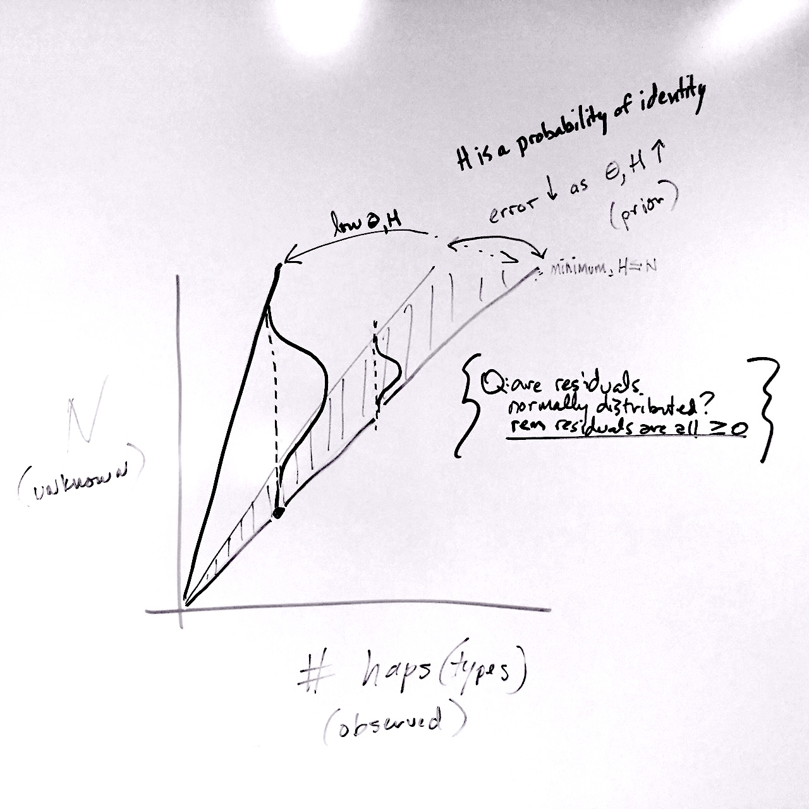

## Barcoding

<style type="text/css">
img {     
  max-height: 500px;     
  max-width: 964px; 
}
</style>
 
<div class="centered">

</div>


When we use a standardized genetic marker to identify species from environmental samples, it is called "genetic barcoding"

- mitochondrial COI and metazoans
- 16S ribosomal and microbes
- FORF and bivalves

## Typically...

Individual tissue/sample harvested, preserved, DNA isolated, PCR, sequencing, match via BLAST or similar algorithm. Requires a database of 'knowns' already, study only as good as prior knowledge can make it!

<style type="text/css">
img {     
  max-height: 400px;     
  max-width: 964px; 
}
</style>
 
<div class="centered">

</div>

## Problems?

> - Imagine a microbe (bacterium). They are probably all the same size, more or less. They may (individual) have varying copies of the 16S gene (picante.R), and substitutions in the primer site affect PCR efficiency. 

> - But we use such data routinely (QIIME) to represent the relative abundance of microbial taxa!


# Now - think of small metazoans, eukaryotes...

## 

<style type="text/css">
img {     
  max-height: 200px;     
  max-width: 964px; 
}
</style>
<div class="centered">


</div>


## So lots of error. Almost useless other than presence/absence?

- variable volume of individual
- variable PCR efficiency
- we are left with qPCR approaches to identify 'presence'...
- or mixed environmental samples where abundance is unreliable!

## Quantitative Barcoding (QuBar)

Goal: environmental sample of organisms (pile of amphipods from an estuary; jar of cladocerans from Carolina Bay; gut contents of a fish), use standard barcode marker, identify what species are present...

...and their relative abundance, with *some* reliability **without using frequency of amplicon sequences**

<style type="text/css">
img {     
  max-height: 300px;     
  max-width: 964px; 
}
</style>


## What information?

- may be able to gauge/estimate total # indivs (volume, count) as **upper limit**
- within *closely* related taxa, PCR efficiency and/or volume may not vary as much (so frequency not always useless)
- **summary statistics from the sequence data?!**

## Summary statistics

Collect related DNA sequence data, align them to each other, that is a lot of information

Ways to summarize:

> - how many unique haplotypes? haplotype diversity?
> - how many variable/segregating sites in the alignment? (S)
> - average pairwise differences ($\pi$)
> - S, $\pi$ are estimators of the almighty $\theta$, population mutation rate :)

## Population mutation rate and DIVERSITY

> - $\pi$ and other measures based on (polymorphic) site ***frequency*** spectrum change little as sample size increases >10, and frequency is the problem we are trying to get around

> - the number of segregating sites, however, is **sample-size dependent** and ***not frequency dependent*** (it is just a number)


## Probability of segregating sites for a sample size, given $\theta$

```{r, echo=FALSE}
maxindivs=50
library(plot3D)
Q = 10 # this is PRIOR information
maxn = min(5*Q,maxindivs) #above 70 this behaves funny???? OR IT MAY BE SOME MULTIPLE OF Q*maxn that is problem?

#obsvdk = Nsite
#maxk = 2*obsvdk #must be greater than obsvdk

inputPanel(
  selectInput("Q", label = "theta:",
              choices = c(1, 2, 3.5, 5, 10), selected = 2),
  
  sliderInput("Nsite", label = "segregating sites:",
              min = 0, max = 20, value = 1, step = 1)
  
  
)


renderPlot({
  
  
maxn = 40 #above 70 this behaves funny???? OR IT MAY BE SOME MULTIPLE OF Q*maxn that 
obsvdk = input$Nsite #OK this needs to be reactive...

maxk = 2*obsvdk #must be greater than obsvdk
#maxk = 20 # lets just set as constant for now...


a <- c(1:maxn)
b <- c(1:maxk)
PSKv <- numeric(maxn*maxk)
PSKv <- matrix(PSKv,ncol=maxn)
colnames(PSKv)<-a
rownames(PSKv)<-b
Qt<-input$Q

for (n in 2:maxn) {

  for (k in 0:maxk) {

    PSK=0
    for (i in 2:n) {
      Qt<-as.numeric(input$Q)
      PSK<-PSK + ((-1)^i)*(choose((n-1),(i-1)))*((i-1)/(Qt+i-1))*(Qt/(Qt+i-1))^k
      
    }

    PSKv[k,n]<-PSKv[k,n]+PSK
    obsvd<-PSKv[obsvdk,]

  }
  
}
  
  hist3D(x=seq(0,1,length.out=nrow(PSKv)),y=seq(0,1,length.out=ncol(PSKv)),PSKv,col=NULL,border="black",theta=40,phi=30,xlab="k",ylab="n",zlab="P{S=k}",alpha=0.35,main=paste((expression(theta))," = ",Qt))


})
```

## Hap Diversity

Two ways to evaluate this, both *may* have information in them. 

A population can be described with 'haplotype diversity'

$$ H = \frac{N}{N-1}(1-\sum\limits_{i=1}x_{i}^2) $$

<div class="red2">
but note some frequency information in there...
</div>


(however at a *minimum*, number of haplotypes is minimum number of individuals)

## How to handle haplotype diversity?

Have been experimenting with a gamma distribution but feels very *ad hoc*, e.g. what are parameters for gamma?

```{r, echo=FALSE}
numhaps=5

inputPanel(
  selectInput("numhaps", label = "numhaps/shape param:",
              choices = c(2, 4, 8, 16, 32), selected = 8),
  
  sliderInput("hapdiv", label = "hap diversity/scale param:",
              min = 0, max = 1, value = 0.8, step = 0.05)
)


renderPlot({
  
number<-as.numeric(input$numhaps)  
diversity<-as.numeric(input$hapdiv)
x=1
cdf=0
indprob=0
array<-NULL
while (cdf<0.99) {
  cdfprev<-cdf
#  cdf<-pgamma(x,1,Hapdiv) 
#  if use 1 as shape parameter keeping shape parameter constant doesn't account for increased variance (?) as numhaps go up, 
#  e.g. error may be higher as you observe more...once it is working run it by somebody mathier.
  cdf<-pgamma(x,number,diversity) #might be that numhaps is actually the shape parameter!!!! or: something else...non-gamma.
  indprob<-cdf-cdfprev
  
  
  happrob<-number+(x-1)
  array<-c(array,happrob)
  array<-c(array,cdf)
  array<-c(array,indprob)
#  print(happrob)
#  print(cdf)
  x=x+1
}


probs<-t(matrix(array,nrow=3))
probs
plot(probs[,1],probs[,3],col='blue')
})
```

## Other ways to handle diversity?

"True Diversity" http://en.wikipedia.org/wiki/Diversity_index generalizable form of diversity indices, including Shannon diversity which is closely related to haplotype diversity.

$$ ^qD = (\sum\limits_{i=1}p_{i}^q)^{1/(1-q)} $$ 

seems good because TD = number of *equally abundant* types needed for the average proportional abundance of the types to equal that observed in the dataset of interest... *i.e.* the frequency can be removed from consideration in next-gen pooled sample, relative to what is known from prior empirical sample (I hope)

## True Haplotype Diversity?

first lets see if 'haplotype diversity' 

$$ H = \frac{N}{N-1}(1-\sum\limits_{i=1}x_{i}^2) $$

can be transformed into *true diversity*, or the effective number of haplotypes...

$$ ^2D = (\sum\limits_{i=1}p_{i}^2)^{-1} = \frac{1}{\sum\limits_{i=1}p_{i}^2} $$ 

close but no, that isn't it. (Shannon diversity *has* been used instead of Haplotype diversity, but they are not exactly equivalent)...do we need to use haplotype diversity or can we simply use True Diversity on haplotype counts?

## Doesn't matter which

We are still dealing with how to handle, probabilistically, the number of individuals that went into our observation *given* the prior information about system

<div class="centered">

</div>

# Another trick | much to learn


## Goals

> - find strength/power/potential of *S* which seems to have greatest power when $\theta$ large relative to number observed segregating sites
> - power/potential of some form of diversity of haplotypes, which appears to have greatest power to estimate *n* when high haplotype diversity (e.g., observed # haps likely closer to # individuals)
> - overall high diversity and limited sample size may be best because cap on *n* (if I know ~200 total indivs in sample, n_i must be <200), # haplotypes puts minimum on *n*


## More Thoughts

the other things you are thinking of, including applications
- screen Noto cline, Cfragilis cline
- microcrustacean zooplankton (replacing Marcus Zokan!)

***recognize it isn't about an exact count but an improvement over 0/1 binary info***

more info on Shiny and **ioSlides** 

rmarkdown.rstudio.com/ioslides_presentation_format.html#incremental-bullets

http://cpsievert.github.io/slides/markdown/#/


