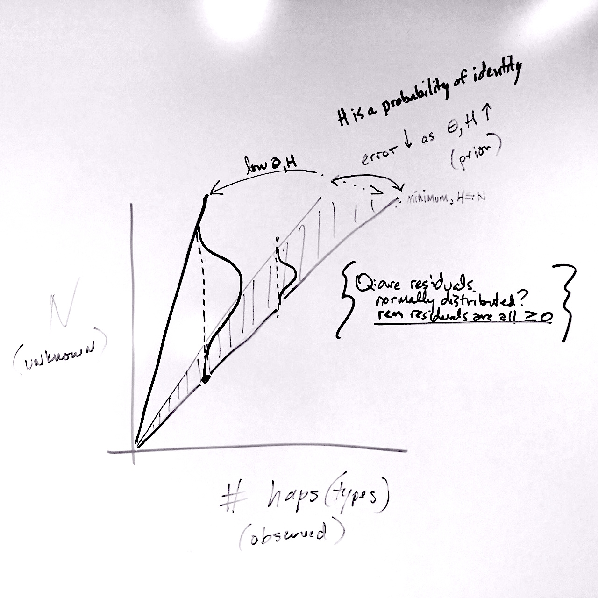

<!-- Paula: this manuscript is where I want to start clean from my prelim work to develop short paper together. -->

We start with what may seem like a trivial question: assume that you have been told that a series of fair coin flips resulted in 60% 'heads', 40% 'tails'. This is the only information given, but you already have made a judgment about how many coin flips occurred, and perhaps have generated a probability distribution in your head where the highest likelihood is for 5 or 10, rather than 50 or 100, events. This is taking advantage of what we know about the probability mass function of a binomial distribution, where the observed number of 'successes' in a series is related to the probability of success (presumably 50%) and the number of trials.  

Here, we argue that the same principle can be used for improving the efficiency of exploring the presence, distribution, and abundance of genetic biodiversity. Documenting the distribution and abundance of biodiversity - in many habitats, at multiple scales - is perhaps more important now than ever as scientists evaluate how populations are responding to environmental change. Though technological advances have rapidly improved some elements of this (remote sensing forest study), there are still glaring deficiencies in our ability to efficiently catalog diversity, even in small domains or limited taxonomic surveys.

The most apparent advances have been in surveys of microbial and viral diversity. Next-generation sequencing has permitted the now-commonplace exploration of fungal, bacterial, and viral diversity by generating 10^5 - 10^6 sequence reads per sample and using barcoding approaches (match of sequence to known taxonomic samples for that genomic region) to identify the taxa present and their relative abundance. While there is no doubt that this has transformed our understanding of functional ecosystem processes at microbial ecology at this scale [@Nguyen14](Moran, Rohwer, Knight refs), there are definite limitations. For example, some taxa (e.g. Archaea) may not be as readily amplified using the same ribosomal 16S "bacteria" primers, and variation in amplification efficiency certainly exists within the Eubacteria [@Acinas05]. Additionally, it is known that some bacterial genomes harbor more than one copy of this canonical locus [@Kembel12], thus muddling the relationship between read frequency and taxon frequency in a community.

The same problems exist - and are exacerbated - when studying multicellular diversity. Most notably, on top of the standard problems of potential contamination, detecting rare taxa and/or handling singleton evidence for rare taxa, and the potentially large variance in individual sizes of organisms, the relative read abundance in a NGS data set will often wildly vary (by multiple orders of magnitude) from the abundance of actual tissue in the data set [@Nguyen14; @Piñol14]. This is caused primarily by shifts in amplification efficiency given mismatches in the primer region, and is often dealt with by analyzing data for simple incidence as well as relative read abundance, to identify patterns robust to either removal of information or inaccurate information [@Nguyen14].

If, however, our goal is to understand the actual relative abundance of individuals of different species in a sample - with these species both harboring variation at 'barcode' loci, and often being highly divergent from one another - the question is whether there is complementary information that can be extracted from these data that does not rely on the abundance of reads that are assigned to a taxon, but relies on our understanding of diversity within populations and how that can be measured. 

The summary statistics for DNA sequence diversity are well established and generally recognize the population mutation rate $\theta$ at a given locus; as a population increases in size, or as the mutation rate at that locus increases, more polymorphisms and more diversity will be found. There are limitations to this approach based on Kimura's neutral theory, as various forms of genomic selection will limit the direct relationship between population size and population diversity [e.g., @Bazin06; @Wares10]. Nevertheless, these summary statistics - including Watterson's $\theta$, a sample-normalized estimator of $\theta$ using the number of segregating sites *S* in a sample - may provide information necessary to generate *some* information about abundance patterns from NGS data. This information also certainly has its limits: nucleotide diversity ($\pi$) will be biased by differential amplification across individuals, as well as relatively uninformative - or diminishing returns - as the number of sampled individuals increases [@Wakeley08]. Haplotype diversity (*H*) is likely sufficient to set a minimum boundary on the number of individuals sampled, and *H* along with *S* have some information about the probability associated with larger numbers of individuals.

Here we present the mathematical considerations necessary to develop these quantitative tools, and then evaluate the situations in which there is sufficient power to make meaningful statements about relative abundance from polymorphism data alone. 

##Methods

```{r basic params, echo=FALSE,warning=FALSE,results='hide',message=FALSE,fig.show='asis'}

# you may have biomass and/or estimate number indivs, e.g. could see ~200 zooplankton in a sample
# put 20, 200, 2000 indivs on NGS to barcode will not change proportion of reads, just changes depths of coverage
# but this info constrains the posterior in units of individuals rather than proportions

maxindivs=200
```

The approach here is identifying information that can comfortably be used as prior information to establish the posterior probability of observing polymorphism data from an *unknown* number of input individuals for a taxon. Some information is clearly limiting: for example, if it is known that only about `r maxindivs` individual specimens were originally used for isolation of DNA, then the maximum number of total individuals recovered from this approach should be about `r maxindivs`. This is perhaps not exciting numerical advance in biology, but limits our prior belief nonetheless.

```{r hapdiv, echo=FALSE,warning=FALSE,results='hide',message=FALSE,fig.show='asis'}

####################################
numhaps=10
Hapdiv=0.75 #minvalue 0.001 if no information; this is PRIOR information
####################################

x=1
cdf=0
indprob=0
array<-NULL
while (cdf<0.99) {
  cdfprev<-cdf
#  cdf<-pgamma(x,1,Hapdiv) 
#  if use 1 as shape parameter keeping shape parameter constant doesn't account for increased variance (?) as numhaps go up, 
#  e.g. error may be higher as you observe more...once it is working run it by somebody mathier.
  cdf<-pgamma(x,numhaps,Hapdiv) #might be that numhaps is actually the shape parameter!!!! or: something else...non-gamma.
  indprob<-cdf-cdfprev
  
  
  happrob<-numhaps+(x-1)
  array<-c(array,happrob)
  array<-c(array,cdf)
  array<-c(array,indprob)
#  print(happrob)
#  print(cdf)
  x=x+1
}

#par(mfrow=c(3,1))

probs<-t(matrix(array,nrow=3))
probs
#plot(probs[,1],probs[,3],col='red')

```

There are also clear minimum bounds that can be established for the abundance of a taxon. Considering DNA sequence haplotypes as our most basic information, we ask how many *distinct* haplotypes are recovered in the data that match a particular taxon? For a haploid mitochondrial marker like the oft-used cytochrome oxidase I (COI), This number is the minimum number of individuals present (if the number happens to be 0, it is also likely to be the maximum number of individuals in the sample). The number of haplotypes recovered from a sample of a species can be summarized with "haplotype diversity", *H*, defined by Nei and Tajima (1981) as $$ H = \frac{N}{N-1}(1-\sum\limits_{i=1}x_{i}^2) $$ and representing the probability that sampling a new individual will result in sample of a new haplotype.

An example of how *H* could be used is shown below for a sample in which `r numhaps` haplotypes are observed, *from a population or taxon with prior information about H*, here with *H* = `r Hapdiv`. In addition to assuming that prior information about the population is useful, here we assume a minimum of `r numhaps` individuals, and that what we do not know can be modeled by a Gamma distribution with the shape defined by the number of haplotypes and scale defined by our prior knowledge of *H*.

```{r fig1, echo=FALSE,warning=FALSE,results='hide',message=FALSE,fig.show='asis'}
plot(probs[,1],probs[,3],col='red')

```

So, observing `r numhaps` haplotypes for this taxon, we might feel comfortable believing there are between 16 and 31 actual individuals that were sampled. The problem lies in the willful abuse of the Gamma distribution without a better understanding of how haplotype diversity *H* and the sample size *N* are related through the frequency of haplotypes - remember, at this point we do not trust the proportion/frequency representation of an allele in our sample.

Another way to approach this is through 'true diversity' indices [reviewed in @Sherwin10], as this family of statistics indicates the number of equally abundant types that have an average frequency equal to the observed average of types. This would mean that instead of taking H as a given from a previously-studied taxon or population, the extant data would be used to calculate $$ ^qD = (\sum\limits_{i=1}^{R}p_{i}^q)^{1/(1-q)} $$ where *R* is richness (number of types). As the Simpson (1949) index is used to indicate the probability that two individuals taken at random from the data are of the same (haplo)type, a comparable statistic to *H* is reached by taking the inverse Simpson index, or $^2D$, and then transforming into the Gini-Simpson index as $1-1/^2D$, again the probability that two individuals have distinct haplotypes.

```{r NotoPrior, echo=FALSE,warning=FALSE,results='hide',message=FALSE,fig.show='asis'}
# rough estimates from Zakas Q is 10, hapdiv is 0.7
# grabbing a file from Geneious....
library(PopGenome)
file<-readData("FastaSeqs") # actual sample size here is 20. That is the number I'd like to come out...AND, TO AN EXTENT, IT IS AT LEAST IN THE INTERVALS FOR BOTH...
#actual<-20
file@n.sites
basic<-diversity.stats(file)
Hapdiv<-basic@hap.diversity.within #haplotype diversity

Nsite<-basic@n.biallelic.sites #number of seg sites taht are biallelic, for now assume ISM
more<-basic@n.polyallelic.sites
varsite<-Nsite+more

filehaps <- F_ST.stats(file,mode="haplotype",only.haplotype.counts=TRUE)
haplotypecounts <- filehaps@region.stats@haplotype.counts
# this is helpful https://github.com/cran/PopGenome/blob/master/vignettes/Integration_of_new_Methods.Rnw 

########

#install.packages("entropart")
library(entropart)
#need frequencies of haplotypes reported from PopGenome so you can use entropart to get 2D
hapfreq<-unlist(haplotypecounts)
actual<-sum(hapfreq)
hapfreq<-hapfreq/actual
numhaps<-length(hapfreq)

Simp<-expq(Simpson(Ps=hapfreq),q=2)
Gini<-1-(1/Simp)

# Watterson estimator of theta
harm=0
for (n in 1:(actual-1)){
  harm=harm+1/n
}

QW <- varsite/harm

```

Evaluating a sample of sequences from the barnacle *Notochthamalus scabrosus*, where `r actual` individuals were haphazardly sampled from the data of Laughlin et al. [-@Laugh12], we see that these data would traditionally report haplotype diversity *H* of `r Hapdiv`, from `r numhaps` observed haplotypes (most dominant haplotype at frequency `r max(hapfreq)`), and in this instance the Gini-Simpson index is equal to `r Gini`. Now we have another statistic that can be calculated from previous data on the population, that focuses on the number of dominant haplotypes. Here, the inverse Simpson index $^2D$ is `r Simp`, the effective number of haplotypes in the system.

**Now I'm not sure what to do with this next. It isn't quite there, because now need to be able to pull a statistic from our UNKNOWN sample to improve on ability to recover the likely individuals that went in. It will still be true that for a population with low *H*, we have little information. (1) worth asking if frequency is OK within species? (2) even if you use frequency and recover the same basic value, there is no connection to N in this statistic on its own. So perhaps hard to improve on some set of assumptions around the Gamma?**

If it IS a probability that a newly sampled individual has a new haplotype, then observing X haplotypes should be able to give us back this distribution in a sense that ignores that the observed haplotypes have frequencies. So perhaps the distribution is bounded by NUMHAPS, but the distribution is shaped by SIMP such that if the effective number haplotypes is much lower than the observed number, that in itself says something about how likelihood changes as N > NUMHAPS (but then both the scale and shape are being influenced by same component??)



Then bring in what you can do with theta and the number of segregating sites.

```{r WakeleyCh4, echo=FALSE,warning=FALSE,results='hide',message=FALSE,fig.show='asis'}
library(plot3D)
Q = 9 # this is PRIOR information from what you know of input SPECIES, not that particular data set (N. scab Q about 10)
maxn = min(4*Q,maxindivs) #above 70 this behaves funny???? OR IT MAY BE SOME MULTIPLE OF Q*maxn that is problem?

obsvdk = varsite
maxk = 2*obsvdk #must be greater than obsvdk


a <- c(1:maxn)
b <- c(1:maxk)
PSKv <- numeric(maxn*maxk)
PSKv <- matrix(PSKv,ncol=maxn)
colnames(PSKv)<-a
rownames(PSKv)<-b

for (n in 2:maxn) {
#  print ("n")
#  print (n)
  for (k in 0:maxk) {
#    print (k)
    PSK=0
    for (i in 2:n) {
#      print (i)
      PSK<-PSK + ((-1)^i)*(choose((n-1),(i-1)))*((i-1)/(Q+i-1))*(Q/(Q+i-1))^k
      
    }
#    print (PSK)
    PSKv[k,n]<-PSKv[k,n]+PSK
    obsvd<-PSKv[obsvdk,]

  }
  
}

hist3D(x=seq(0,1,length.out=nrow(PSKv)),y=seq(0,1,length.out=ncol(PSKv)),PSKv,col=NULL,border="black",theta=30,phi=30,xlab="k",ylab="n",zlab="P{S=k}",alpha=0.35,main=paste((expression(theta))," = ",Q))

```


```{r test for simulating data, eval=FALSE}
library(PopGenome)
# PopGenome has the MS function that allows to use for coalescent simulations to derive the expected neutral distribution of Tajima's D. 
# better help for the MS function
# http://www.inside-r.org/packages/cran/PopGenome/docs/MS
# The problem with this is that you need to install the C files of the ms program, and that cannot be done in windows. In this link you can find ms program http://home.uchicago.edu/rhudson1/source/mksamples.html
# The following code should work if that is achieve in linux or macs.
# load data
#file<-readData("FastaSeqs")
# we apply the neutrality stats and with that output we run simulations
#file<-neutrality.stats(file,list(1:6))
# we call Hudson program
#ms.file <- MS(file, thetaID="Tajima", neutrality=TRUE)
# we can extract the simulated Tajima's D values
#MS.get.stats(ms.file)

# Another option if to use phyclust package that has a ms function included
library(phyclust)

# To read sequences from a fasta file
data<-read.fasta("FastaSeqs/NotoSample.fas")
class(data) # class 'seq.data'
data$org.code # this is the matrix with our original data
data$nseq # number of sequences in our data
data$seqlen # length of the sequences

# we need to set a seed for our simulations
set.seed(1234)

# to simulate trees (we use our number of sequences as number of tips)
data.trees<-ms(nsam=data$nseq, nreps=1, opts= "-T -t 0.2")

# to extract the tree and convert it to 'phylo' object
simtree<-read.tree(text=data.trees[3])
simtree

# to simulate sequences (we use both our sequence length and number of sequences)
set.seed(1234)
data.seqs<-seqgen(opts= "-mHKY -l481 -q", rooted.tree=simtree)
class(data.seqs) #seqgen

# to read the 'seqgen' object and convert to 'seq.data'
data.seqs.easy<-read.seqgen(data.seqs)
class(data.seqs.easy) #seq.data
str(data.seqs.easy) # in $org we can find the sequences

# to save in fasta file so we can use with PopGenome
write.fasta(data.seqs.easy$org,"simSequences.fas")

```


##Results

```{r nextfig, echo=FALSE,warning=FALSE,results='hide',message=FALSE,fig.show='asis'}
#  print(obsvd) #now would be easy to print 95% HPD of obsvd, so for given theta and k this is the distribution of n
  plot(obsvd,xlab="n",ylab="P(n|k)",ylim=c(0,0.15),main=paste("for K =",obsvdk, "and theta =",Q,"in black; for hapdiv in red"))
points(probs[,1],probs[,3],col='red')
abline(v=actual)


```

Remember that the input data for this single taxon included `r actual` individuals, the vertical line in plot above. What is likelihood function? Product of the two distributions? That is too stark in areas where they don't really overlap probabilities. Shouldn't be ZERO there?

Need to then adapt this to a sample from 4-5 species for which there is known information? Or do simulated data (X species, vector of theta in simulation and hapdiv when all said and done, they are after all, related) and adjust the evenness in series of plots to see if evenness/richness gets recovered appropriately, given confidence intervals after all...

n.b. Marc Feldman was concerned about the two statistics double-dipping on the same theory... is this ABC, is this borrowing strength, is this inappropriate?? **AH. but certainly *S* and *H* are not independent observations thus cannot simply use product of the two to generate a Likelihood** perhaps identify which is better, useful, or are neither sufficient?


##Discussion
Returning to the coin flip, it is worth evaluating wherein lies the strength of inferential signal. 50% gives NO information, could be 2 or infinite flips. So it is deviation that is signal in the coin flip example. Similarly, for a system of diversity such as this we need the *potential* for diverse outcomes to evaluate: low theta means nearly all sample sizes are possible, for example. In this sense, developing this with a mind for species that are broadly distributed and highly abundant is likely a more effective strategy than endemic small populations.

##Acknowledgments
Idea brought about by extended problem-solving session with J. Drake, helped greatly by C. Ewers-Saucedo and K. Bockrath. Work supported by funding from NSF-OCE-Chile, OVPR, and UGA Department of Genetics.

##Literature Cited


